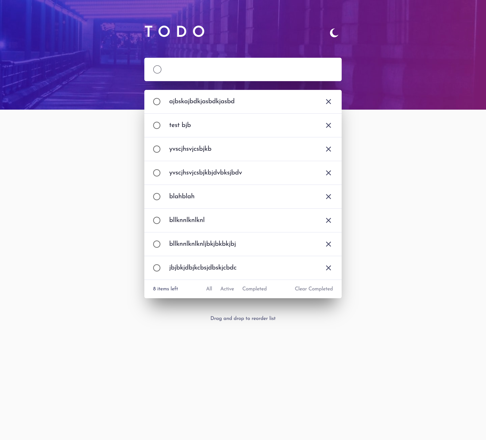
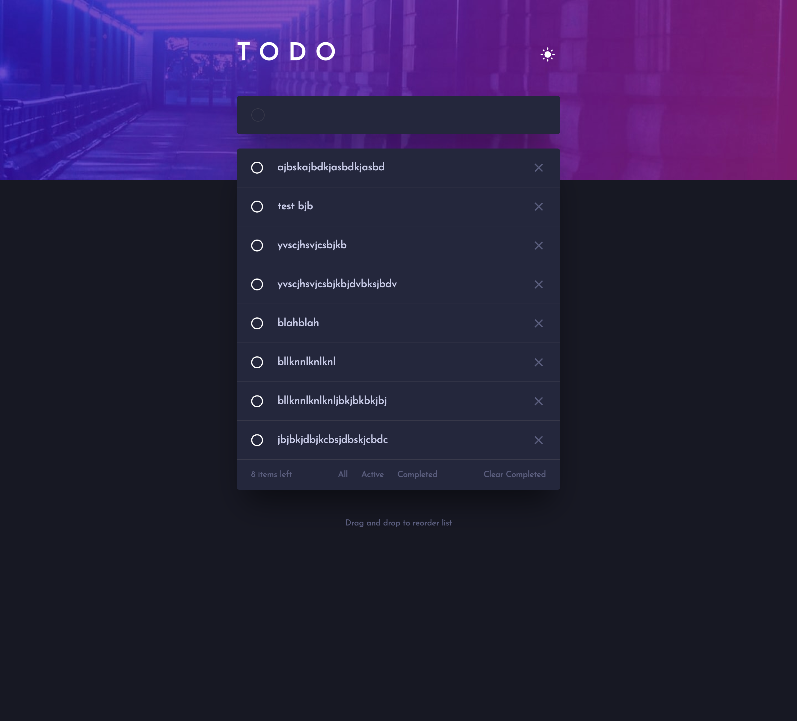

# Frontend Mentor - Todo app solution

This is a solution to the [Todo app challenge on Frontend Mentor](https://www.frontendmentor.io/challenges/todo-app-Su1_KokOW). Frontend Mentor challenges help you improve your coding skills by building realistic projects.

## Table of contents

- [Overview](#overview)
  - [The challenge](#the-challenge)
  - [Screenshot](#screenshot)
  - [Links](#links)
- [My process](#my-process)
  - [Built with](#built-with)
  - [What I learned](#what-i-learned)
- [Author](#author)

## Overview

### The challenge

Users should be able to:

- View the optimal layout for the app depending on their device's screen size
- See hover states for all interactive elements on the page
- Add new todos to the list
- Mark todos as complete
- Delete todos from the list
- Filter by all/active/complete todos
- Clear all completed todos
- Toggle light and dark mode
- **Bonus**: Drag and drop to reorder items on the list

### Screenshot




### Links

- Live Site URL: [https://fm-todo-list-app.vercel.app/](https://fm-todo-list-app.vercel.app/)

## My process

### Built with

- Flexbox
- CSS Grid
- [React](https://reactjs.org/) - JS library
- Material UI - For Icons, components and Styled Component
- Firebase - For DB and BE
- Typescript
- [react-beautiful-dnd](https://www.npmjs.com/package/react-beautiful-dnd?activeTab=readme) - For Drag and Drop functionality

**Note: These are just examples. Delete this note and replace the list above with your own choices**

### What I learned

As part of this project, I learned how to configure Google Firebase. I just google firebase as my Database and used its endpoints to update the DB for CRUD operations.

```js
// Import the functions you need from the SDKs you need
import { initializeApp } from 'firebase/app';
import { getFirestore } from 'firebase/firestore';

// Your web app's Firebase configuration
const firebaseConfig = {
  apiKey: process.env.REACT_APP_API_KEY,
  authDomain: 'todo-app-f3b40.firebaseapp.com',
  projectId: 'todo-app-f3b40',
  storageBucket: 'todo-app-f3b40.appspot.com',
  messagingSenderId: '303405057588',
  appId: '1:303405057588:web:33f5aba15e4ed7d1172c61',
};

// Initialize Firebase
initializeApp(firebaseConfig);
export const db = getFirestore();
```

I also learned how to add and use Beautiful dnd, this was challenging as I ran into some issues where dragging would convert the whole container as the droppable area. Learning where to place the <Droppable /> wrapper was the key.

```js
<DragDropContext
  onDragEnd={(result) => {
    onDragEnd(result);
  }}
>
  <Grid
    mt={3}
    container
    display="flex"
    sx={{
      width: '540px',
      borderRadius: '5px',
      bgcolor: 'background.paper',
      boxShadow: '0px 35px 50px -15px rgba(0, 0, 0, 0.50)',
    }}
  >
    <Droppable droppableId="list" type="group" key="1">
      {(provided) => {
        return (
          <Grid
            {...provided.droppableProps}
            ref={provided.innerRef}
            sx={{ minHeight: '128px' }}
          >
            {todoItems?.map((item, index) => {
              return (
                <TodoItem
                  todoItem={item}
                  index={index}
                  onDeleteTodoItem={onRemoveTodoItem}
                  onUpdateStatus={onUpdateStatus}
                />
              );
            })}
            {provided.placeholder}
          </Grid>
        );
      }}
    </Droppable>
    <Grid
      item
      key="sorting-list"
      display="flex"
      alignItems="center"
      sx={{ width: '540px', height: '50px', flexShrink: '0' }}
    >
      <Grid
        display="flex"
        justifyContent="space-between"
        sx={{ width: '540px', padding: '0 24px' }}
      >
        <StyledTypography>{`${
          todoItems?.length ?? 0
        } items left`}</StyledTypography>
        <Grid
          display="flex"
          justifyContent="space-between"
          sx={{ width: '166px' }}
        >
          {filters.map((option) => (
            <FilterButton option={option} onFilterClick={handleFilter} />
          ))}
        </Grid>
        <Grid display="flex">
          <StyledButton onClick={onClearCompleteItems}>
            Clear Completed
          </StyledButton>
        </Grid>
      </Grid>
    </Grid>
  </Grid>

  <Grid
    container
    display="flex"
    justifyContent="center"
    sx={{
      width: '540px',
      marginTop: '49px',
    }}
  >
    <StyledTypography>{`Drag and drop to reorder list`}</StyledTypography>
  </Grid>
</DragDropContext>
```

## Author

- Website - Martin Olague (https://github.com/molague2021)
